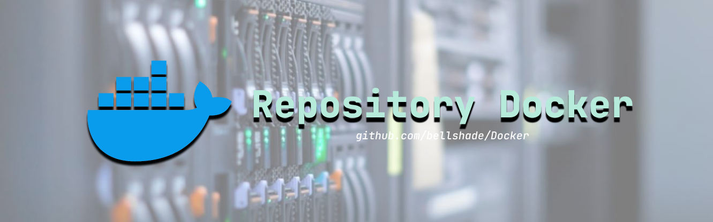

# *Contributing*

***Contributor***

Kami sangat senang anda telah ikut berkontribusi dalam implementasi algortima, struktur data, atau memperbaiki *error*.
Semua boleh ikut berkontribusi sekecil apapun dengan pengecualian sebagai berikut:

- Hasil pekerjaan kamu adalah buatan kamu sendiri dan tidak ada hak cipta dari orang lain. Jika kami menemukan kesamaan, maka tidak kami *merge*.
- Hasil kerja kamu akan berlisensi [MIT](LICENSE) ketika *pull request* kamu sudah di-*merge*.
- Hasil kerja kamu wajib mengikuti standar dan *style* koding dari kami.
s
## Testing Image
**Installasi**
Untuk testing image saat ini kalian wajib memiliki python untuk test docker image yang sudah kalian buat. Kalian bisa ikuti beberapa langkah dibawah ini 
```
pip install -r requirements.txt
```
Setelah install requirements, cara kalian testing image kalian bisa ikuti command dibawah, jika file Dockerfile kalian ada di tempat lain kalian bisa arahkan langsung misal di `./path/Dockerfile` dan untuk port nya sesuaikan dengan port dari expose imagenya
```console
python build.py [FILE] [PORT]

or

python3 build.py [FILE] [PORT]
```

# *Pull Request*

***Pull request* yang baik**

Informasi: gunakan [*issue*](https://github.com/bellshade/Docker/issues) apabila ingin menambahkan materi atau sample project, dll (*basic*) agar tidak ada konflik dengan *pull request* lainnya. Kamu juga bisa menggunakan issue jika kamu ada 
kendala atau masalah ketika melakukan pull request. Kamu juga bisa bertanya pada forum discord **WPU** dan **Kelas Terbuka** perihal bellshade.

- Lakukan penjelasan deskripsi perubahan yang anda lakukan pada repositori kami dengan membuat penjelasan di [*issue*](https://github.com/bellshade/Docker/issues).
- Setelah menjelaskan perubahan anda di [*issue*](https://github.com/bellshade/Docker/issues) kemudian lakukan *fork* pada repositori kami.
- Setelah melakukan *fork*, anda dibebaskan untuk mengubah atau menambah materi / sample project.
  - Untuk *pull request* merubah atau memperbaiki, diusahakan kamu menggunakan bahasay yang lebih baik dan lebih mudah serta memeberikan penjelasan lebih detail alasan dari perubahaan tersebut lebih baik dari sebelumnya.
- Jka terdapat file `shell` sebaiknya di testing di local terlebih dahulu
- Setelah merubah-rubah atau menambahkan materi / sample proejct serta melakukan tes di lokal, usahakan kamu membuat *local branch* baru:
  ```bash
  git checkout -b <branch_name>
  git add . # atau git add nama_perubahan_kamu.py
  git commit -m "feat: menambahkan materi terbaru"
  ```
- Lakukan *push* ke *branch* kamu dan kemudian *open pull request*.

**Saran pesan commit**

- `feat:` untuk menambah algoritma atau tambahan lainnya;
- `fix:` untuk mengubah algoritma yang sudah ada atau memperbaiki;
- `docs:` untuk mengubah atau membuat dokumentasi;
- `add:` untuk menambah algoritma atau tambahan lainnya (opsional);

Catatan: pesan commit harus menjelaskan perubahan secara singkat.

Contoh yang benar:
- &#9746; feat: Dockerfile
- &#9745; feat: menambahkan materi baru

Lebih lengkapnya bisa dilihat di:
- [EN](https://www.conventionalcommits.org/en/v1.0.0/)
- [ID](https://www.conventionalcommits.org/id/v1.0.0/)

Pull request akan di-*merge* jika:

- mengikuti standar dan arahan dari `CONTRIBUTING.md`;
- lulus tes dan cek dari beberapa tes yang sudah kami siapkan.

**Tambahan**:

- Jika ada kendala atau masalah dalam *pull request*, kamu bisa laporkan masalahnya dalam [issue](https://github.com/bellshade/Docker/issues).
- Jika ada tes yang tidak lewat atau gagal, kami akan cek kembali perubahan anda.

Untuk *pull request*, disarankan untuk menjelaskan secara detail yang kamu ubah atau tambahkan, dan bersikap sopan serta selalu berterima kasih. Itu salah satu bentuk tata krama yang baik terhadap sesama *contributor* dan *programmer* lainnya.