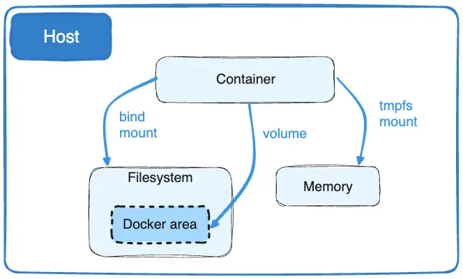

## Docker Volume


Kita tahu bahwa docker itu sendiri adalah container tools. Dimana setiap folder yang ada, config-an yang ada itu hanya bisa diakses ketika kita di dalam containernya. Namun docker sendiri telah menyediakan fitur volume. Fitur inilah yang membuat kita bisa meng-export dan melihat perubahan secara realtime dari container ke local server kita. Maka dari itu developer sering menggunakan ini agar suatu saat ketika ada BUG didalam production mereka bisa backup data secara cepat.

Namun jika tipe data kalian adalah `persistent-data` kalian sebenarnya bisa mount / binding data ke local kalian dengan `tmpfs`. Namun tipe penyimpanan ini ialah bersifat sementara, ia akan terus bekerja ketika container dalam keadaan running. Namun jika container itu sendiri restart ataupun berhenti maka data nya juga akan hilang

## Command Volume


Untuk membuat volume sendiri kalian bisa menggunakan 
```
$ docker volume create [NAME_VOLUME]
```
Setelah kalian buat , kalian tinggal pasang saja ke container yang kalian ingin binding datanya

```
$ docker run -dp [PORT_PUBLISH]:[PORT_IMAGE] --name=testing-app --mount source=[NAME_VOLUME],target=[TARGET_DIRECTORY] sample-image
```
Jadi ketika kalian ingin binding docker volume kalian bisa langsung saja pakai flag `--mount` lalu tambahkan source volume yang sudah kalian buat dan arahkan path yang mau kalian ingin backup. Nah nanti jika kalian inspect containernya maka akan keluar source volume dan target mountnya

```
$ docker inspect testing-app

"Mounts": [
    {
        "Type": "volume",
        "Name": "myvol2",
        "Source": "/var/lib/docker/volumes/myvol2/_data",
        "Destination": "/app",
        "Driver": "local",
        "Mode": "",
        "RW": true,
        "Propagation": ""
    }
],
```

## Volume in Compose
Sebenarnya kalian bisa saja setup volume didalam docker compose. Secara otomatis akan dibuat, dan bahkan kalian bisa secara realtime menerima data baru. Misal disini saya punya image `postgres` nah saya ingin data yang didalam postgress ada di folder local saya. Sample confignya kalian bisa lihat disini [docker-compose.yml](./docker-compose.yml). Atau kalian bisa juga configan seperti ini

```yml
# version untuk saat ini ialah version 3.9 
# untuk installasi kalian bisa jalanin saja script di root folder ini `install.sh`
version: '3.9'
# services define apa saja yang akan dilakukan build 
# bahkan sampai pembuatan container dan running juga
services:
  # ini nama service bebas mau apa aja asal readable dalam team
  db:
    # image yang digunakan untuk service db
    image: postgres:alpine

    # nama container , sebenarnya biar mudah saja di kelola
    # karena secara default docker sudah membuat nama container secara otomatis
    container_name: db-app

    # hostname , ini defaultnya kosong , jadi kalian bisa setup
    hostname: db

    # env, ini penting apalagi berhubungan dengan statefull data
    # setiap image punya env berbeda beda, kalian bisa liat di official docs docker hubnya
    environment:
      - POSTGRES_USER=bellshade
      - POSTGRES_DB=sample_db
      - POSTGRES_PASSWORD=bellshade
    
    # port yang akan dipublish 
    # tergantung dari image
    # setiap image punya port yang berbeda beda 
    ports:
      - 5432:5432
    
    volumes:
      # path volume dari docker image kalian bisa lihat di official docsnya
      # untuk ke local bebas tergantung kalian mau simpan dimana
      - ./data/backup:/var/lib/postgresql/data
```